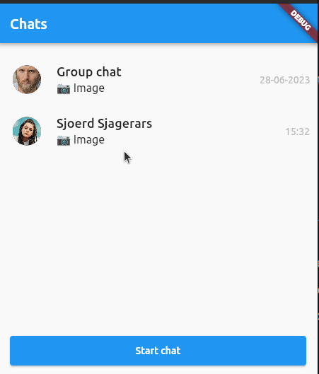

# Flutter Chat

Flutter Chat is a package which gives the possibility to add a (personal or group) chat to your Flutter-application.
By default this package adds support for a Firebase back-end but you can also add a custom back-end (like a Websocket-API) by extending the `ChatInterface` interface from the `flutter_chat_interface` package.



The default UI is based on a Figma design that defines this component, however it's only accessible by Iconica developers:
[Figma design](https://www.figma.com/file/4WkjwynOz5wFeFBRqTHPeP/Iconica-Design-System?type=design&node-id=357%3A3342&mode=design&t=XulkAJNPQ32ARxWh-1).
There is also a Figma clickable prototype that demonstrates this component:
[Figma clickable prototype)[https://www.figma.com/proto/PRJoVXQ5aOjAICfkQdAq2A/Iconica-User-Stories?page-id=1%3A2&type=design&node-id=56-6837&viewport=279%2C2452%2C0.2&t=E7Al3Xng2WXnbCEQ-1&scaling=scale-down&starting-point-node-id=56%3A6837&mode=design]

## Setup

To use this package, add flutter_chat as a dependency in your `pubspec.yaml` file:

```yaml
  flutter_chat:
    git:
      url: https://github.com/Iconica-Development/flutter_chat
      path: packages/flutter_chat
```

You can use the `LocalChatService` to test the package in your project:

```dart
ChatUserStoryConfiguration(
  chatService: LocalChatService(),
),
```

If you are going to use Firebase as the back-end of the Chat, you should also add the following package as a dependency to your `pubspec.yaml` file:

```yaml
  flutter_chat_firebase:
    git:
      url: https://github.com/Iconica-Development/flutter_chat
      path: packages/flutter_chat_firebase
```

Create a Firebase project for your application and add Firebase Firestore and Storage.

Make sure you are authenticated using the `firebase_auth` package or adjust your firebase rules, otherwise you won't be able to retreive data.

Also make sure you have the corresponding collections in your Firebase project as defined in `FirebaseChatOptions`, you can override the
default paths as you wish:
```dart
  const FirebaseChatOptions({
    this.groupChatsCollectionName = 'group_chats',
    this.chatsCollectionName = 'chats',
    this.messagesCollectionName = 'messages',
    this.usersCollectionName = 'users',
    this.chatsMetaDataCollectionName = 'chat_metadata',
    this.userChatsCollectionName = 'chats',
  });
  ```

Also the structure of your data should be equal to our predefined models, you can implement any model by making your own model and implementing one of the predefined interfaces like so:

```dart
class ChatMessageModel implements ChatMessageModelInterface {
  ChatMessageModel({
    required this.sender,
    required this.timestamp,
  });

  @override
  final ChatUserModel sender;

  @override
  final DateTime timestamp;
}
```

The various interfaces you can implement:

- `ChatUserModelInterface`,
- `ChatImageMessageModelInterface`,
- `ChatTextMessageModelInterface`
- `ChatMessageModelInterface`,
- `ChatModelInterface`,
- `GroupChatModelInterface`,
- `PersonalChatModelInterface`,

Add the following to your project to use the camera or photo library to send pictures:

For ios add the following lines to your info.plist:

```plist
<key>NSCameraUsageDescription</key>
<string>Access camera</string>
<key>NSPhotoLibraryUsageDescription</key>
<string>Library</string>
```

For android add the following lines to your AndroidManifest.xml:

```xml
<uses-permission android:name="android.permission.CAMERA" />
<uses-permission android:name="android.permission.GALLERY"/>
```

## How to use

To use the module within your Flutter-application with predefined `go_router` routes you should add the following:

Add go_router as dependency to your project, then add the following configuration to your flutter_application:

```dart
List<GoRoute> getChatRoutes() => getChatStoryRoutes(
      ChatUserStoryConfiguration(
        chatService: chatService,
        chatOptionsBuilder: (ctx) => const ChatOptions(),
      ),
    );
```

You can override any method in the `ChatUserStoryConfiguration`.

Add the `getChatRoutes()` to your go_router routes like so:

```dart
final GoRouter _router = GoRouter(
  routes: <RouteBase>[
    GoRoute(
      path: '/',
      builder: (BuildContext context, GoRouterState state) {
        return const MyHomePage(
          title: "home",
        );
      },
    ),
    ...getChatRoutes()
  ],
);
```

The routes that can be used to navigate are:

For routing to the `ChatScreen`:

```dart
  static const String chatScreen = '/chat';
```

For routing to the `ChatDetailScreen`:

```dart
  static String chatDetailViewPath(String chatId) => '/chat-detail/$chatId';
  static const String chatDetailScreen = '/chat-detail/:id';
```

For routing to the `NewChatScreen`:

```dart
static const String newChatScreen = '/new-chat';
```

For routing to the `ChatProfileScreen`:
you can see the information about a person or group you started a chat with.
If the userId is null a group profile screen will be shown otherwise the profile of a single person will be shown.

```dart
static String chatProfileScreenPath(String chatId, String? userId) =>
'/chat-profile/$chatId/$userId';
static const String chatProfileScreen = '/chat-profile/:id/:userId';
```

Add the following code to the build-method of a chosen widget to use the module within your Flutter-application without predefined `go_router` routes but with Navigator routes:

```dart
chatNavigatorUserStory(
  ChatUserStoryConfiguration(
    chatService: ChatService,
    chatOptionsBuilder: (ctx) => const ChatOptions(),
  ),
  context,
);
```

Just like with the `go_router` routes you can override any methods in the `ChatUserStoryConfiguration`.

Or create your own routing using the screens.

Add the following code to add the `ChatScreen`:

```dart
ChatScreen(
  options: options,
  onPressStartChat: onPressStartChat,
  onPressChat: onPressChat,
  onDeleteChat: onDeleteChat,
  service: service,
  pageSize: pageSize,
  );
```

The `ChatDetailScreen` shows the messages that are in the current chat you selected.
To add the `ChatDetailScreen` add the following code:

```dart
ChatDetailScreen(
  options: options,
  onMessageSubmit: onMessageSubmit,
  onUploadImage: onUploadImage,
  onReadChat: onReadChat,
  service: service,
  );
```

On the `NewChatScreen` you can select a person to chat.

Add the following coe to add the `NewChatScreen`:

```dart
NewChatScreen(
  options: options,
  onPressCreateChat: onPressCreateChat,
  service: service,
  );
```

On the `ChatProfileScreen` you can see the information about a person or group you started a chat with.
A group profile screen will be shown if the userId is null, otherwise the profile of a single person will be shown.

```dart
ChatProfileScreen(
  chatService: chatservice,
  chatId: chatId,
  translations: translations,
  onTapUser: onTapUser,
  userId: userId,
);
```

The `ChatEntryWidget` is a widget you can put anywhere in your app, it displays the amount of unread messages you currently have.
You can choose to add an `onTap` to the `ChatEntryWidget` so it routes to the `ChatScreen`.

Add the following code to add the `ChatEntryWidget`:

```dart
ChatEntryWidget(
  chatService: chatService,
  onTap: onTap,
);
```

The `ChatOptions` has its own parameters, as specified below:
| Parameter | Explanation |
|-----------|-------------|
| newChatButtonBuilder | Builds the 'New Chat' button, to initiate a new chat session. This button is displayed on the chat overview. |
| messageInputBuilder | Builds the text input which is displayed within the chat view, responsible for sending text messages. |
| chatRowContainerBuilder | Builds a chat row. A row with the users' avatar, name and eventually the last massage sended in the chat. This builder is used both in the _chat overview screen_ as in the _new chat screen_. |
| imagePickerContainerBuilder | Builds the container around the ImagePicker. |
| closeImagePickerButtonBuilder | Builds the close button for the Image Picker pop-up window. |
| scaffoldBuilder | Builds the default Scaffold-widget around the Community Chat. The chat title is displayed within the Scaffolds' title for example. |

The `ImagePickerTheme` also has its own parameters, how to use these parameters can be found in [the documentation of the flutter_image_picker package](https://github.com/Iconica-Development/flutter_image_picker).

## Issues

Please file any issues, bugs or feature request as an issue on our [GitHub](https://github.com/Iconica-Development/flutter_chat/pulls) page. Commercial support is available if you need help with integration with your app or services. You can contact us at [support@iconica.nl](mailto:support@iconica.nl).

## Want to contribute

If you would like to contribute to the plugin (e.g. by improving the documentation, solving a bug or adding a cool new feature), please carefully review our [contribution guide](./CONTRIBUTING.md) and send us your [pull request](https://github.com/Iconica-Development/flutter_chat/pulls).

## Author

This `flutter_chat` for Flutter is developed by [Iconica](https://iconica.nl). You can contact us at <support@iconica.nl>
